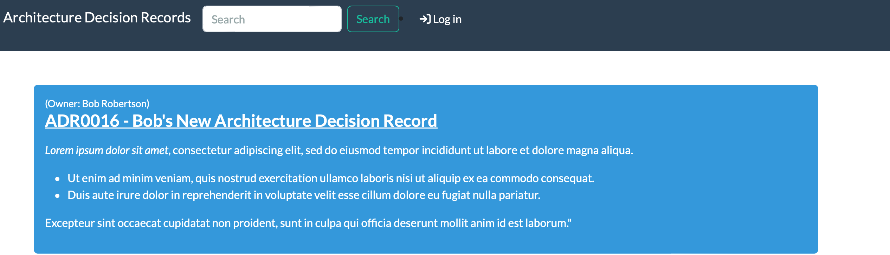

# Installing the App

## Prerequisites

This section describes the system dependencies required for The App. They can be all installed on a single system, or distributed across your environment. That will be up to you. Our install instructions assume a single system install, and that is good for most use cases. More advanced configurations are also possible, but are not covered here.

Here you will find detailed instructions on how to __install__ and __configure__ the App on Ubuntu 20.04/22.04 LTS.

### Install System Packages

Install the prerequisite system libraries and utilities.

This will install:

- Git
- Python 3
- Pip
- Redis server and client
- PostgreSQL server and client

```bash
sudo apt update -y
sudo apt install -y git python3 python3-pip python3-venv python3-dev postgresql
```

#### LDAP authentication

Install the prerequisite system libraries for LDAP authentication.

```bash
sudo apt update -y
sudo apt install -y libsasl2-dev libldap2-dev libssl-dev
```

### Database Setup

In this step you'll create a database and database user for use by the App, and verify your connection to the database.

#### Create a PostgreSQL Database

At a minimum, we need to create a database for the App and assign it a username and password for authentication. This is done with the following commands.

!!! danger
    __Do not use the password from the example.__ Choose a strong, random password to ensure secure database authentication for your the App installation.

```no-highlight
sudo -u postgres psql
```

Example output:

```no-highlight
psql (14.7 (Ubuntu 14.7-0ubuntu0.22.04.1))
Type "help" for help.

postgres=# CREATE DATABASE adr;
CREATE DATABASE
postgres=# CREATE USER adr_db_usr WITH PASSWORD 'insecure_password';
CREATE ROLE
postgres=# GRANT ALL PRIVILEGES ON DATABASE adr TO adr_db_usr;
GRANT
postgres=# \q
```

#### Verify PostgreSQL Service Status

You can verify that authentication works issuing the following command and providing the configured password. (Replace `localhost` with your database server if using a remote database.)

If successful, you will enter a `adr` prompt. Type `\conninfo` to confirm your connection, or type `\q` to exit.

```no-highlight
psql --username adr_db_usr --password --host localhost adr
```

Example output:

```no-highlight
Password:
psql (14.7 (Ubuntu 14.7-0ubuntu0.22.04.1))
SSL connection (protocol: TLSv1.3, cipher: TLS_AES_256_GCM_SHA384, bits: 256, compression: off)
Type "help" for help.

adr=>  \conninfo
You are connected to database "adr" as user "adr_db_usr" on host "localhost" (address "127.0.0.1") at port "5432".
SSL connection (protocol: TLSv1.3, cipher: TLS_AES_256_GCM_SHA384, bits: 256, compression: off)
adr=> \q
```

## Installation

This section of the documentation discusses installing and configuring the application itself.

These instructions will guide you through the following actions:

- Establish an App root directory for the application environment
- Create an App `adr` system account
- Create a Python virtual environment (virtualenv)
- Install the App and all required Python packages
- Run the database schema migrations
- Aggregate static resource files on disk
- Verify the installation using the development/test server

!!! important
    Your database server and Redis must have been successfully installed before continuing with deployment steps. If you haven't done that yet, please visit the guide on installing the [App Prerequisites](#prerequisites)

### Choose your `ADR_ROOT`

You need to select a directory path where everything related to the ADR App will be installed. We will use this value across the documentation and it will be referred to as `ADR_ROOT`.

We will be using this path as the home directory of the `adr` user.

!!! tip
    We have selected `/opt/adr`, but you may use any directory you choose.

Later on, we will need to set this directory path as the `ADR_ROOT` environment variable to tell the ADR App where to find its files and settings.

### Create the App System User

Create a system user account named `adr`. This user will own all of the App files, and the web services will be configured to run under this account.

The following command also creates the `/opt/adr` directory and sets it as the home directory for the user.

```no-highlight
sudo useradd --system --shell /bin/bash --create-home --home-dir /opt/adr adr
```

### Setup the Virtual Environment

A Python [virtual environment](https://docs.python.org/3/tutorial/venv.html) or _virtualenv_ is like a container for a set of Python packages. A virtualenv allows you to build environments suited to specific projects without interfering with system packages or other projects.

When installed per the documentation, the ADR App uses a virtual environment in production.

In the following steps, we will have you create the virtualenv within the `ADR_ROOT` you chose in the previous step. This is the same we had you set as the home directory as the `adr` user.

!!! note
    Instead of deliberately requiring you to activate/deactivate the virtualenv, we are emphasizing on relying on the `$PATH` to access programs installed within it. We find this to be much more intuitive and natural when working with the App in this way.

#### Create the Virtual Environment

As root, we're going to create the virtualenv in our `ADR_ROOT` as the `adr` user to populate the `/opt/adr` directory with a self-contained Python environment including a `bin` directory for scripts and a `lib` directory for Python libraries.

```no-highlight
sudo -u adr python3 -m venv /opt/adr
```

#### Update the App User `.bashrc`

So what about the `ADR_ROOT`? We've referenced this environment variable several times. Here is where it finally gets set.

We need to set the `ADR_ROOT` environment variable for the `adr` user and make sure that it always set without having to do it manually.

Run this command to update `~/.bashrc` for `adr` so that anytime you become `adr`, your `ADR_ROOT` will be set automatically.

```no-highlight
echo "export ADR_ROOT=/opt/adr" | sudo tee -a ~adr/.bashrc
```

### Sudo to adr

It is critical to install the ADR App as the `adr` user so that we don't have to worry about fixing permissions later.

```no-highlight
sudo -iu adr
```

Observe also that you can now echo the value of the `ADR_ROOT` environment variable that is automatically set because we added to `.bashrc`:

```no-highlight
echo $ADR_ROOT
```

Example output:

```no-highlight
/opt/adr
```

!!! warning
    Unless explicitly stated, all remaining steps requiring the use of `pip3` or `python manage.py` in this document should be performed as the `adr` user!

### Understanding the Virtual Environment

Because the `adr` user was created with `ADR_ROOT` set as its home directory and we had you set the shell to `/bin/bash`, the binary path `$ADR_ROOT/bin` is automatically added to the beginning of the `$PATH` environment variable:

In Ubuntu >=20.04:

```no-highlight
echo $PATH
```

Example output:

```no-highlight
/opt/adr/bin:/usr/local/sbin:/usr/local/bin:/usr/sbin:/usr/bin:/sbin:/bin:/snap/bin
```

Due to differences between OS, in CentOS `$PATH` will appear as:

```no-highlight
echo $PATH
```

Example output:

```no-highlight
/opt/adr/.local/bin:/opt/adr/bin:/opt/adr/.local/bin:/opt/adr/bin:/sbin:/bin:/usr/sbin:/usr/bin:/usr/local/sbin

```

Therefore, any commands executed by the `adr` user will always check `$ADR_ROOT/bin` first.

Since `ADR_ROOT` also contains the Python virtualenv for the ADR App, all of the commands you will execute as the `adr` user, will automatically prefer the virtualenv's commands because they come first in the `$PATH`.

As the `adr` user, you may use `which pip3` to confirm that you are using the correct version of `pip3`. The path should match that of `$ADR_ROOT/bin`. For example:

```no-highlight
which pip3
```

Example output:

```no-highlight
/opt/adr/bin/pip3
```

This makes sure that the version of Python you're using, as well any dependencies that you install, remain isolated in this environment.

### Prepare the Virtual Environment

Before we install anything into the virtualenv, we want to make sure that Pip is running the latest version.

[Pip](https://pip.pypa.io/) is Python's package installer and is referred interchangeably as `pip` or `pip3`. For the purpose of this document, we'll deliberately be referring to it as `pip3`. Many common issues can be solved by running the latest version of Pip. Before continuing with installing the ADR App, upgrade Pip to its latest release.

We also want to deliberately install the `wheel` library which will tell Pip to always try to install wheel packages if they are available. A [wheel is a pre-compiled Python package](https://realpython.com/python-wheels/), which is quicker and safer to install because it does not require development libraries or `gcc` to be installed on your system just so that some more advanced Python libraries can be compiled.

```no-highlight
pip3 install --upgrade pip wheel
```

### Install the App

!!! warning "Developer Note - Remove Me!"
    Detailed instructions on how to get the app from GitHub.

Use Pip to install the requirements:

```no-highlight
pip3 install architecture-decision-records
```

Great! We have `ADR_ROOT` ready for use by the `adr` user, so let's proceed to verifying the installation.

## Verify your Installation

You should now have a  `adrs` (Architecture Decisions Records - Server)  command in your environment. This will be your gateway to all things for the _architecture-decision-records_! Run it to confirm the installed version of `architecture-decision-records`:

```no-highlight
adrs --version
```

Example output:

```no-highlight
0.1.0
```

## Configuration

Before you can use the ADR App, you'll need to configure it by telling it where your database can be found, among other things. This is done with the `adr_config.py` configuration file.

### Initialize your configuration

Initialize a new configuration by running `adrs init`. You may specify an alternate location and detailed instructions for this are covered in the documentation on [Configuration](../configuration/index.md).

However, because we've set the `ADR_ROOT`, this command will automatically create a new `adr_config.py` at the default location based on this at `$ADR_ROOT/adr_config.py`:

```no-highlight
adrs init
Configuration file created at /opt/adr/adr_config.py
```

### Required Settings

Your `adr_config.py` provides sane defaults for all of the configuration settings. You will inevitably need to update the settings for your environment, most notably the [`DATABASES`](../configuration/required-settings.md#databases) setting. If you do not wish to modify the config, by default, many of these configuration settings can also be specified by environment variables. Please see [Required Settings](../configuration/required-settings.md) for further details.

Edit `$ADR_ROOT/adr_config.py`, and head over to the documentation on [Required Settings](../configuration/required-settings.md) to tweak your required settings. At a minimum, you'll need to update the following settings:

- [`ALLOWED_HOSTS`](../configuration/required-settings.md#allowed_hosts): You must set this value. This can be set to `["*"]` for a quick start, but this value is not suitable for production deployment.
- [`DATABASES`](../configuration/required-settings.md#databases): Database connection parameters. If you installed your database server on the same system as the ADR App, you'll need to update the `USER` and `PASSWORD` fields here. If you are using MySQL, you'll also need to update the `ENGINE` field, changing the default database driver suffix from `django.db.backends.postgresql` to `django.db.backends.mysql`.

!!! important
    You absolutely must update your required settings in your `adr_config.py` or the ADR App will __not work___.

Save your changes to your `adr_config.py` and then proceed to the next step.

### Prepare the Database

Before the App can run, the database migrations must be performed to prepare the database for use. This will populate the database tables and relationships:

```no-highlight
adrs migrate
```

### Create a Superuser

The App does not come with any predefined user accounts. You'll need to create a administrative superuser account to be able to log into the App for the first time.

```no-highlight
adrs createsuperuser
```

### Create Static Directories

The App relies upon many static files including:

- `media` - For storing uploaded images and attachments
- `static` - The home for CSS, JavaScript, and images

Each of these have their own corresponding setting that defined in `adr\settings\_base.py`, but by default they will all be placed in `ADR_ROOT` unless you specify otherwise by customizing their unique variable.

The `collectstatic` command will create these directories if they do not exist, and in the case of the `static` files directory, it will also copy the appropriate files:

```no-highlight
adrs collectstatic
```

## Check your Configuration

The ADR App leverages Django's built-in [system check framework](https://docs.djangoproject.com/en/stable/topics/checks/#writing-your-own-checks) to validate the configuration to detect common problems and to provide hints for how to fix them.

Checks are ran automatically when running a development server using `adrs runserver`, but not when running in production using WSGI.

!!! hint
    Get into the habit of running checks before deployments! :octicons-smiley-16:

```no-highlight
adrs check
```

## Test the Application

At this point, we should be able to run the ADR App's development server for testing. We can check by starting a
development instance:

```no-highlight
adrs runserver 0.0.0.0:8080 --insecure
```

Next, connect to the name or IP of the server (as defined in `ALLOWED_HOSTS`) on port 8080; for example, <http://127.0.0.1:8080/>. You should be greeted with the Application home page.

!!! danger
    __DO NOT USE THIS SERVER IN A PRODUCTION SETTING.__ The development server is for development and testing purposes only. It is neither performant nor secure enough for production use.

!!! warning
    If the test service does not run, or you cannot reach the ADR App home page, something has gone wrong. Do not proceed with the rest of this guide until the installation has been corrected. Some platforms (such as CentOS) have a firewall enabled by default. If you are unable to connect to the server url on port 8080, verify the firewall policy to allow the appropriate connections, or select an already permitted port.

Note that the initial user interface will be locked down for non-authenticated users.



Try logging in using the superuser account we just created. Once authenticated, you'll be able to access all areas of the UI:


Type `Ctrl-C` to stop the development server. Now you're ready to proceed to starting the App as a system service.
