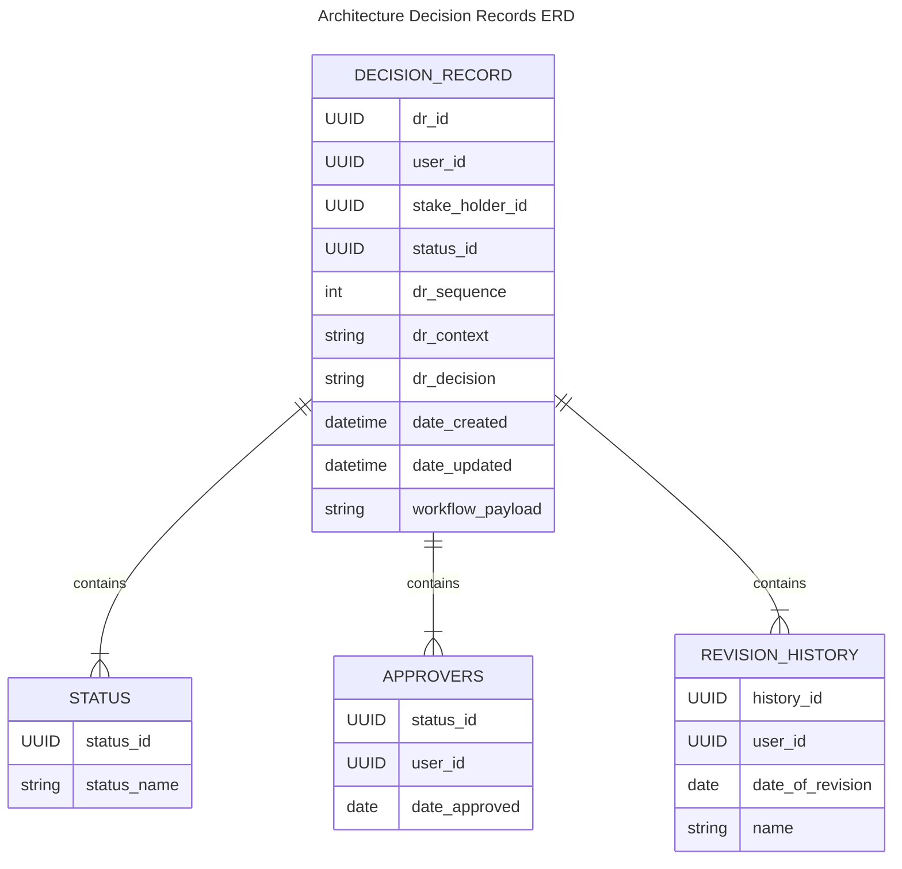

# Introduction

## Purpose

An Architectural Decision (AD) is a design choice that addresses a functional or non-functional requirement that is architecturally significant. This might, for instance, be a routing protocol choice (e.g., ospf vs bgp vs eigrp), a choice of the Infrastructure Device (e.g., Cisco vs. Arista), or a decision on features. Do not take the term “architecture” too seriously or interpret it too strongly. As the examples illustrate, any decisions that might have an impact on the architecture somehow are architectural decisions.

It should be as easy as possible to

1. write down the decisions
1. to version the decisions

There are debates what is an architecturally-significant decision and which decisions are not architecturally significant. Since we believe that any (important) decision should be captured in a structured way, we offer this ADR app to capture any decision.

## Document Conventions

This document uses the following conventions.

| Abbreviation | Meaning |
| :---- | :---- |
| UX | User Experience (User Interface) |
| ADR | Architecture Design Records |
| MADR | Markdown Any Decision Records |

<!-- Abbreviation descriptions for hover -->
*[UX]: User Experience
*[ADR]: Architecture Decision Records
*[MADR]: Markdown Any Decision Records

### Intended Audience and Reading suggestions

This project is a prototype for and ADR app which will manage the creation, and management of Architecture Decision Records as described on the [ADR](https://adr-dj.github.io/)

### Project Scope

The purpose of this project is to build an application to capture Architecture Decisions in a lean format for later reference

## Overall Description

### Feature Perspective

This app will follow the MADR lean template to capture any decisions in a structured way. The template originated from capturing architectural decisions and developed to a template allowing to capture any decisions taken.

{: style="width: 75%;"}

### Characteristics

- Have a quick reference to understand what has been done in the past
- Allow us to share our thinking and methods with our stakeholders
- Maintain open and transparent communication inside and outside of our teams

### Operating Environment and Dependencies

The initial operating environment for the ADR app is as below:

- PostgreSQL DB hosted
- Django as the UX dashboard

### Entity Relationship Diagram

### Design and Implementation Constraints

Follow the guiding principles [here](https://adr-dj.github.io/madr/) and [here](https://www.cognitect.com/blog/2011/11/15/documenting-architecture-decisions).
